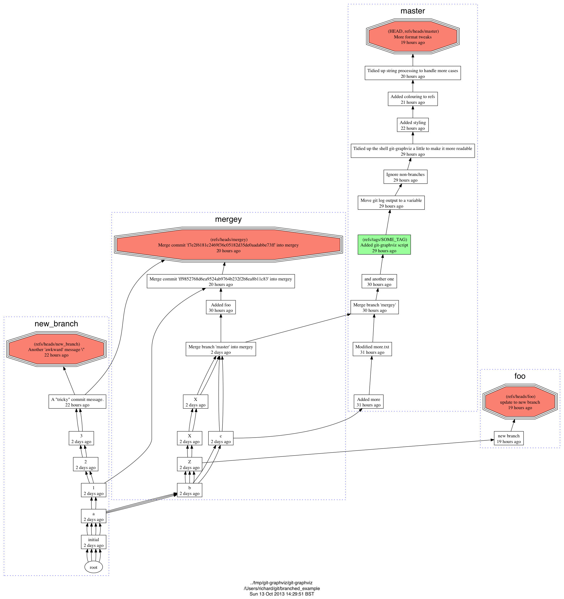

git-graphviz
============

Produce [Graphviz][1] graphs of your git repository history.

Commits are grouped by branch name and labelled with:
1. ref
2. commit message
3. relative commit time

Any commits which are a head and tag refs are each given a different style to ordinary commits.

Usage
-----
To produce a dot file for the current repository:

`git-graphiz > graph.dot`

git-graphviz uses git log, and all command line arguments are passed to it. This means you can do things like:

`git-graphviz --since="4 weeks"` 

To convert the dot file to a pdf file use dot:

`dot -Tpdf -o graph.pdf graph.dot`

Alternatively to create a png:

`dot -Tpng -o graph.png graph.png`

The output from git-graphviz can be piped directly into dot:

`git-graphviz --since="4 weeks" | dot -Tpdf -o graph.pdf`

Limitations
-----------
Only tested on OS X Mountain Lion and with a small number of repositories. I've guarded against some
special characters in commit messages but it is possible that invalid dot file could be produced for other inputs.

With the default options repositories with lots of commits can
produce *very* big dot files which are hard to process. Consider using
a --since argument or --simplify-by-decoration.

Branches are listed in alphabetical order which can make (for example) master appear as a branch, rather than as your mainline.

Origin
------
A project I worked on had a management imposed branching strategy which
lead to a number of active topic branches at any time. (Based on that proposed by [nvie][2]). 
The development teams were happy visualising this using normal developer tools,
but management preferred to view a manually generated Powerpoint document.

These documents quickly became out of date, and did not give a clear indication
of how long a topic branch had been away from master. Creating this script
provided a mechanism for automatically creating management friendly branch reports. 

The intial implementation idea came from the [git wiki][3].

[1]: http://www.graphviz.org "Graphviz"
[2]: http://nvie.com/posts/a-successful-git-branching-model/ "nvie.com"
[3]: https://git.wiki.kernel.org/index.php/Aliases#Use_graphviz_for_display "Git Wiki"

